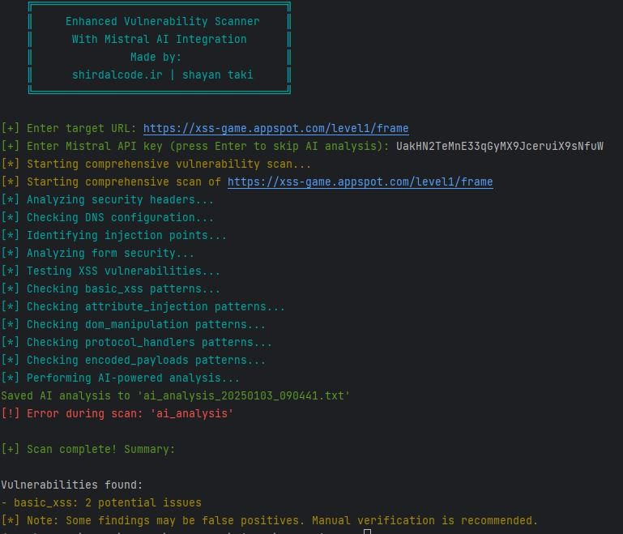

# xssTools-ai-shirdal




این پروژه یک اسکنر آسیب‌پذیری پیشرفته است که برای شناسایی نقاط ضعف امنیتی در وب‌سایت‌ها طراحی شده است. این ابزار از قابلیت‌های هوش مصنوعی و الگوهای از پیش تعریف‌شده برای تحلیل جامع استفاده می‌کند.

## نصب و راه‌اندازی

برای استفاده از این پروژه، مراحل زیر را دنبال کنید:

### پیش‌نیازها
- نصب Python نسخه 3.8 یا بالاتر.
- نصب ابزارهای مورد نیاز پروژه.

### مراحل نصب
1. ابتدا مخزن پروژه را کلون کنید:
   ```bash
   git clone https://github.com/shayanTaki/xssTools-ai-shirdal
   ```

2. وارد پوشه پروژه شوید:
   ```bash
   cd xssTools-ai-shirdal
   ```

3. کتابخانه‌های مورد نیاز را با استفاده از فایل `requirements.txt` نصب کنید:
   ```bash
   pip install -r requirements.txt
   ```

4. اجرای اسکنر:
   ```bash
   python3 main.py
   ```

## نحوه استفاده

1. پس از اجرای اسکریپت `main.py`، برنامه از شما درخواست می‌کند که آدرس وب‌سایت هدف را وارد کنید. مطمئن شوید که آدرس با `http://` یا `https://` شروع شود.

2. همچنین می‌توانید در صورت نیاز، کلید API برای یکپارچگی با Mistral AI را وارد کنید. اگر کلید را ندارید، می‌توانید این مرحله را رد کنید.

3. نتایج اسکن در یک فایل JSON با نامی شبیه به `results_<تاریخ و زمان>.json` ذخیره می‌شوند.

## ویژگی‌ها

- تحلیل هدرهای امنیتی.
- شناسایی نقاط تزریق و آسیب‌پذیری‌های XSS.
- بررسی پیکربندی DNS.
- امکان استفاده از هوش مصنوعی Mistral برای تحلیل دقیق‌تر.

## ارتباط با ما
- [ShirdalCode](https://shirdalcode.ir)
- [GitHub](https://github.com/shayanTaki)

 
